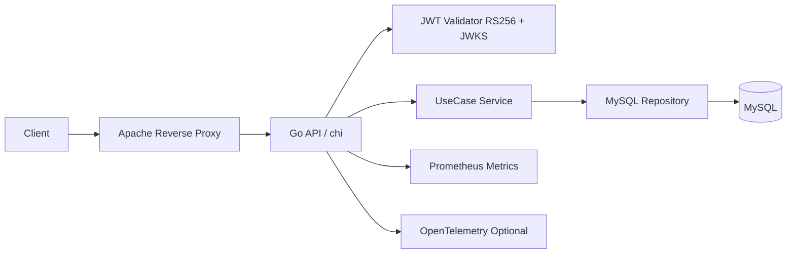

# Architecture Diagram

```mermaid
flowchart LR
  client[Client] --> apache[Apache Reverse Proxy]
  apache --> app[Go API / chi]
  app --> auth[JWT Validator RS256 + JWKS]
  app --> svc[UseCase Service]
  svc --> repo[MySQL Repository]
  repo --> db[(MySQL)]
  app --> metrics[Prometheus Metrics]
  app --> otel[OpenTelemetry Optional]
```
