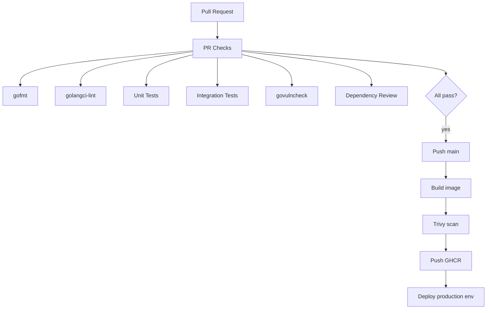

# CI/CD Flow

```mermaid
flowchart TD
  PR[Pull Request] --> PRC[PR Checks]
  PRC --> FMT[gofmt]
  PRC --> LINT[golangci-lint]
  PRC --> UT[Unit Tests]
  PRC --> IT[Integration Tests]
  PRC --> VULN[govulncheck]
  PRC --> DEP[Dependency Review]
  PRC --> MERGE{All pass?}
  MERGE -- yes --> MAIN[Push main]
  MAIN --> BUILD[Build image]
  BUILD --> SCAN[Trivy scan]
  SCAN --> PUSH[Push GHCR]
  PUSH --> DEPLOY[Deploy production env]
```
