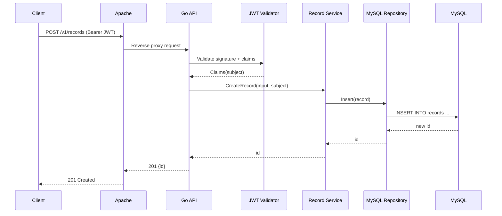

# Sequence POST /v1/records

```mermaid
sequenceDiagram
  participant C as Client
  participant A as Apache
  participant API as Go API
  participant J as JWT Validator
  participant S as Record Service
  participant R as MySQL Repository
  participant DB as MySQL

  C->>A: POST /v1/records (Bearer JWT)
  A->>API: Reverse proxy request
  API->>J: Validate signature + claims
  J-->>API: Claims(subject)
  API->>S: CreateRecord(input, subject)
  S->>R: Insert(record)
  R->>DB: INSERT INTO records ...
  DB-->>R: new id
  R-->>S: id
  S-->>API: id
  API-->>A: 201 {id}
  A-->>C: 201 Created
```
