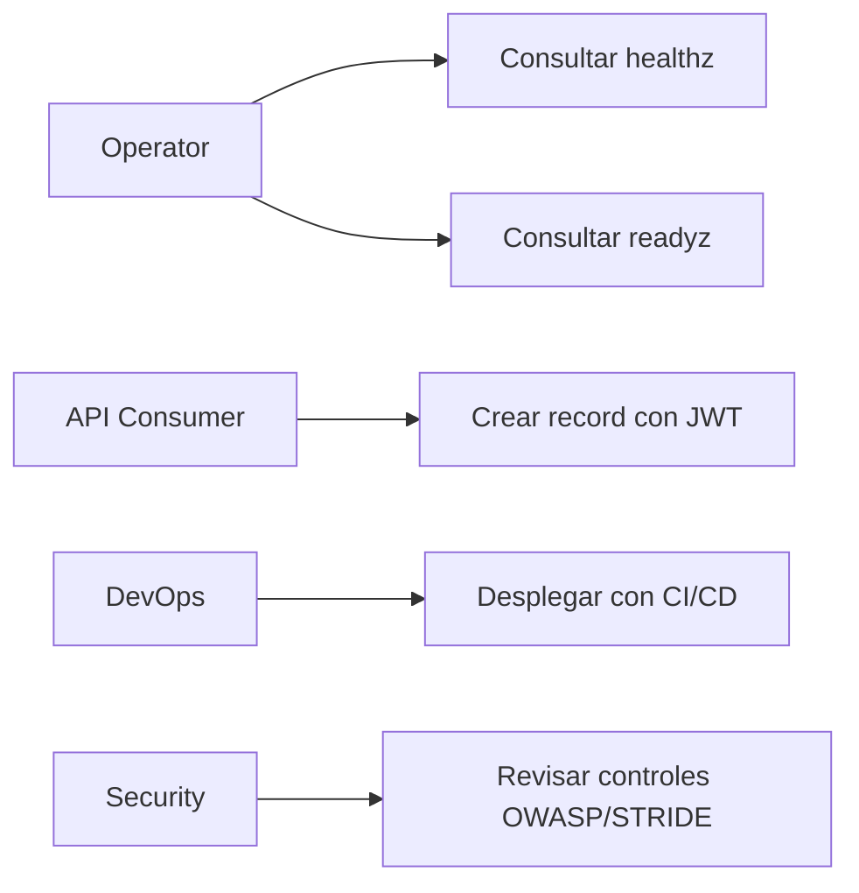

# Use Cases

```mermaid
flowchart LR
  operator[Operator] --> uc1[Consultar healthz]
  operator --> uc2[Consultar readyz]
  consumer[API Consumer] --> uc3[Crear record con JWT]
  devops[DevOps] --> uc4[Desplegar con CI/CD]
  security[Security] --> uc5[Revisar controles OWASP/STRIDE]
```
